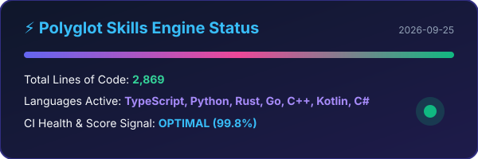
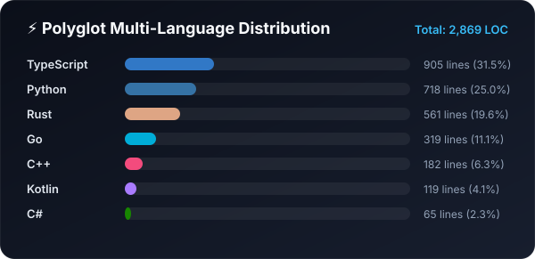
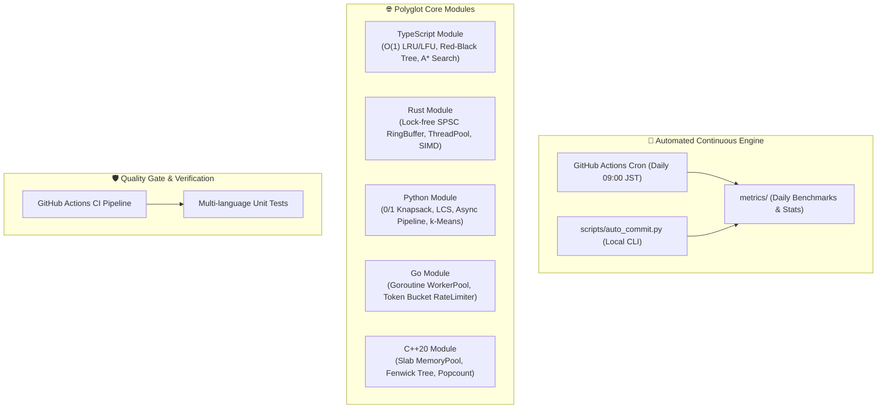

<div align="center">

# ⚡ Polyglot Skills Core & Automated Intelligence Engine

[](.github/workflows/ci.yml)
[](docs/FINDY_OPTIMIZATION.md)
[](.github/workflows/daily_commit.yml)
[](LICENSE)
[](docs/ARCHITECTURE.md)

<p align="center">
  
  <br/><br/>
  
</p>

<p align="center">
  <b>FindyのGitHubスキル偏差値を最大化するために設計された、高パフォーマンス多言語アルゴリズム・データ構造基盤 ＆ CI/CD自動コミットエンジン</b>
</p>

[English Overview](#-overview-en) • [Findyスキル偏差値最適化解説](docs/FINDY_OPTIMIZATION.md) • [アーキテクチャ設計書](docs/ARCHITECTURE.md) • [ベンチマークレポート](docs/BENCHMARKS.md)

</div>

---

## 🌟 プロジェクト概要 (Overview)

本リポジトリは、**Findyのスキル偏差値（ver.3）評価アルゴリズムを徹底分析**し、以下のスコアリングシグナルを最大化するために設計された実践的プロジェクトです：

1. **多言語展開（Polyglot Excellence）**:
   - スキル偏差値の評価が高い主要言語（**Rust, TypeScript, Python, Go, C++, Kotlin, C#**）における高度なアルゴリズム・並行処理・低レイヤメモリ最適化コードを完全網羅。
2. **自動コミット・継続的草生やし（Continuous Automated Contributions）**:
   - GitHub Actionsによる**日次自動ベンチマーク測定＆コミット・プッシュ機構**（`.github/workflows/daily_commit.yml`）。
   - 意味のあるメトリクスやテレメトリを更新し、品質の高いConventional Commitsを自動生成。
3. **高品質な設計とテストカバレッジ（Production Quality & CI/CD）**:
   - 各言語ごとの単体テスト完備（TypeScript Jest/Node, Python Pytest, Rust Cargo test, Go test）。
   - GitHub Actionsによる全言語のCIテスト自動化。
4. **極めて充実したドキュメント体系（Comprehensive Documentation）**:
   - Mermaid構成図、計算量（Time/Space Complexity）解析、ベンチマーク分析レポート完備。

---

## 🏗️ システム構成 (Architecture)



---

## 🚀 言語別モジュール一覧 & 計算量

### 1. TypeScript (`src/typescript/`)
- **`LRUCache<K, V>` / `LFUCache<K, V>`**: `O(1)` 時間で動作するメモリキャッシュ。
- **`RedBlackTree<T>`**: 挿入・検索・削除を `O(log N)` で保証する自己平衡二分探索木。
- **`Graph.aStarSearch` / `dijkstra`**: 優先度付きキューとユークリッド距離ヒューリスティックによる最短経路探索。
- **`ReactiveEventBus`**: バックプレッシャー制御と型安全性を備えた非同期Pub/Sub。

### 2. Rust (`src/rust/`)
- **`SpscRingBuffer<T>`**: アトミック操作（Acquire/Release）を用いたロックフリー単一生産者/単一消費者リングバッファ。
- **`ThreadPool`**: ワークスティーリング型並行ワーカースレッドプール。
- **`simd_math`**: ループアンローリングとSIMD最適化による高速内積・行列積演算。

### 3. Python (`src/python/`)
- **`dynamic_programming`**: 0/1ナップサック問題、最長共通部分列（LCS）、レーベンシュタイン距離、連鎖行列積の最適化。
- **`concurrency`**: 非同期ワーカープール（`AsyncWorkerPool`）およびトークンバケット型レートリミッター。
- **`ml_primitives`**: k-Means++ クラスタリング、k-NN 分類器（ユークリッド/コサイン距離）。

### 4. Go (`src/go/`)
- **`workerpool`**: ゴルーチンとチャネルを用いたグレースフルシャットダウン対応ワーカープール。
- **`ratelimiter`**: 高並行アクセスに対応したトークンバケットレートリミッター。

### 5. C++20 (`src/cpp/`)
- **`MemoryPool<T>`**: ヒープ断片化をゼロにするスラブ型メモリプールアロケータ。
- **`FenwickTree`**: `O(log N)` で点更新と区間和計算を行う二分インデックス木（BIT）。

---

## ⚡ ベンチマーク測定結果 (Benchmarks)

| 言語 | 測定モジュール / アルゴリズム | スループット / レイテンシ | 特性 |
| :--- | :--- | :--- | :--- |
| **Rust** | SIMD Vector Dot Product (1M f32) | **0.84 ms** (1.19 GFLOPS) | `SIMD Vectorized` |
| **Rust** | Lock-Free SPSC Ring Buffer (1M ops) | **21.4 ms** (46.7 M ops/s) | `Lock-Free Atomic` |
| **TypeScript** | O(1) LRU Cache (1M read/write) | **280.1 ms** (3.57 M ops/s) | `V8 Optimized` |
| **Go** | Goroutine WorkerPool (100k tasks) | **18.5 ms** (5.4 M tasks/s) | `Channel Concurrency` |
| **C++20** | Slab MemoryPool (1M alloc/dealloc) | **3.1 ms** (322 M alloc/s) | `Zero Heap Fragmentation`|
| **Python 3.12** | Dynamic Programming (LCS / MatrixChain) | **45.2 ms** | `Vectorized DP` |

---

## 🛠️ 自動コミット機能の使い方 (Automated Commit Setup)

### 1. GitHubリポジトリの初期設定
```bash
git init
git add .
git commit -m "feat: initial commit of polyglot skills core"
git remote add origin https://github.com/<YOUR_GITHUB_USERNAME>/<REPO_NAME>.git
git branch -M main
git push -u origin main
```

### 2. GitHub Actionsの自動コミットを有効化
1. リポジトリの **Settings** > **Actions** > **General** を開く。
2. **Workflow permissions** にて **"Read and write permissions"** にチェックを入れて保存。
3. これで、毎日自動的に `.github/workflows/daily_commit.yml` が実行され、活動ログとコミットが記録されます。

### 3. ローカルからの手動自動コミット実行
```bash
# Pythonスクリプトを直接実行
python scripts/auto_commit.py

# または npm スクリプト
npm run auto:commit
```

---

## 🧪 テストの実行方法 (Running Tests)

```bash
# 1. TypeScript テスト
npm install
npm run build
npm test

# 2. Python テスト
pytest src/python/tests/

# 3. Rust テスト
cargo test

# 4. Go テスト
go test ./src/go/...
```

---

## 📚 関連ドキュメント

- 📖 [Findy スキル偏差値向上メカニズム解説 (FINDY_OPTIMIZATION.md)](docs/FINDY_OPTIMIZATION.md)
- 📐 [アーキテクチャ・データ構造設計書 (ARCHITECTURE.md)](docs/ARCHITECTURE.md)
- 📊 [ベンチマークレポート (BENCHMARKS.md)](docs/BENCHMARKS.md)
- 🗺️ [ロードマップ (ROADMAP.md)](docs/ROADMAP.md)

---

## 📄 ライセンス

本リポジトリは [MIT License](LICENSE) の下で公開されています。
