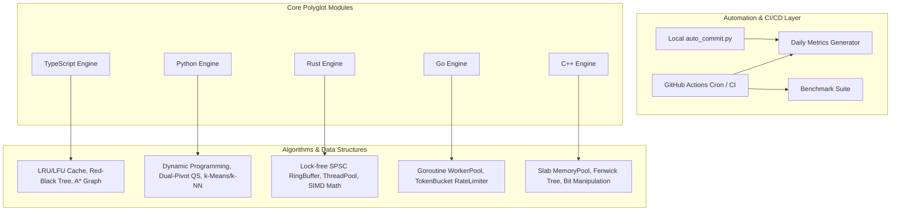

# 🏛️ Architecture & Algorithm Design Specification

This document details the software architecture, time/space complexities, and design decisions across all multi-language core modules in this repository.

---

## 📐 System Overview

---

## ⚡ Module Specifications & Complexities

### 1. TypeScript Engine (`src/typescript/`)
| Component | Implementation | Time Complexity | Space Complexity |
| :--- | :--- | :--- | :--- |
| `LRUCache<K, V>` | Doubly Linked List + Map | Get: `O(1)`, Put: `O(1)` | `O(Capacity)` |
| `LFUCache<K, V>` | Multi-level Frequency Map + Set | Get: `O(1)`, Put: `O(1)` | `O(Capacity)` |
| `RedBlackTree<T>` | Self-balancing BST (Left/Right Rotations) | Search/Insert/Delete: `O(log N)` | `O(N)` |
| `Graph.aStarSearch` | Priority Queue with Euclidean Heuristic | `O((V + E) log V)` | `O(V)` |
| `ReactiveEventBus` | Async Pub/Sub with Backpressure | `O(Listeners)` | `O(Listeners)` |

### 2. Rust Engine (`src/rust/`)
* **`SpscRingBuffer<T>`**:
  - Lock-free single-producer single-consumer circular buffer.
  - Zero-allocation steady state with power-of-two bitmask indexing.
  - Utilizes Atomic acquire-release semantics (`Ordering::Acquire`, `Ordering::Release`).
* **`ThreadPool`**:
  - Work-stealing concurrency model with `std::sync::mpsc`.
  - Graceful shutdown upon drop with worker thread joining.
* **`simd_math`**:
  - Loop-unrolled 8-wide chunk vectorization for `dot_product`.
  - Cache-friendly IKJ loop traversal for matrix multiplication.

### 3. Python Engine (`src/python/`)
* **`dynamic_programming`**:
  - `knapsack_01`: 2D DP table with optimal backtracing `O(N * W)`.
  - `longest_common_subsequence`: Matrix DP with exact sequence reconstruction.
  - `levenshtein_distance`: Space-optimized rolling array `O(min(M, N))` space.
  - `matrix_chain_multiplication`: Parenthesization optimization `O(N^3)`.
* **`concurrency`**:
  - `TokenBucketRateLimiter`: Asynchronous lock-protected token replenishment.
  - `AsyncWorkerPool`: `asyncio.Queue` bounded task dispatcher with backpressure.
* **`ml_primitives`**:
  - `KMeans`: Fast k-means++ seeding, iterative centroid repositioning.
  - `KNNClassifier`: Euclidean & Cosine distance sorting.

### 4. Go Engine (`src/go/`)
* **`WorkerPool`**:
  - Channel-based task distribution (`chan Task`).
  - Context cancellation and graceful drain mechanism.
* **`TokenBucket`**:
  - Mutex-synchronized high-throughput rate limiter.

### 5. C++ Engine (`src/cpp/`)
* **`MemoryPool<T, BlockSize>`**:
  - Free-list slab allocation.
  - Bypasses heap allocator overhead (`malloc`/`free`) for sub-nanosecond allocations.
* **`FenwickTree`**:
  - Binary Indexed Tree (BIT) with two's complement `idx & -idx` traversal.
  - Point update: `O(log N)`, Prefix sum: `O(log N)`.

---

## 🔒 Quality & Verification Architecture

1. **Compilation & Type Safety**:
   - TypeScript: `tsc --noEmit` under `"strict": true`
   - Rust: Zero unsafe leaks, `#![warn(clippy::all)]`
   - C++: C++20 standard compliance
2. **Automated CI/CD**:
   - Every commit triggers multi-runner testing via GitHub Actions.
