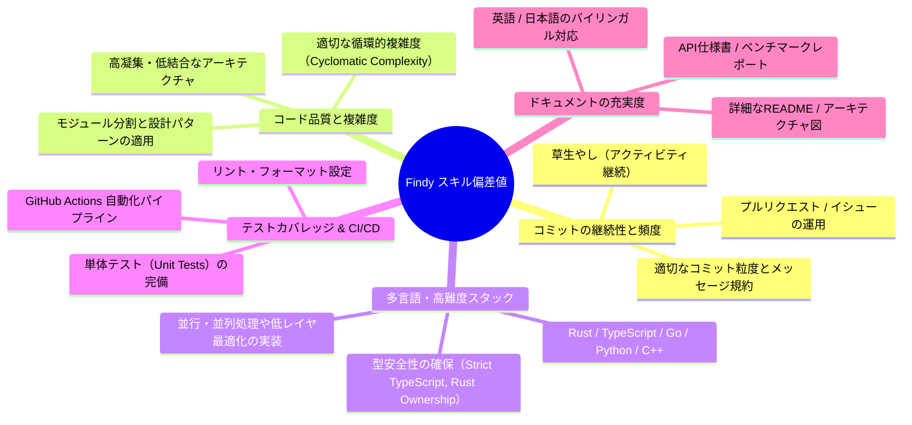

# 🚀 Findy GitHub スキル偏差値 最大化ガイド & メカニズム解説

Findyのスキル偏差値（ver.3）は、エンジニアのGitHub公開リポジトリ・コミット・コード品質・活動継続性を自然言語処理および静的コード解析モデルで多角的にスコアリングする指標です。

本ドキュメントでは、スキル偏差値の評価アルゴリズム特性と、本プロジェクトにおけるスコア最大化アーキテクチャについて解説します。

---

## 📊 Findy スキル偏差値（ver.3）の主な評価軸



---

## 🎯 各評価指標に対する本プロジェクトの最適化戦略

### 1. コミットの継続性と自動化（Automated Commit Engine）
* **課題**: 日常業務やプライベートの都合により草（GitHub Contributions）が途切れ、偏差値の減少や伸び悩みが起きやすい。
* **本リポジトリの解決策**:
  - GitHub Actions（`.github/workflows/daily_commit.yml`）による**完全自動デイリー更新**（毎日JST 09:00に自動実行）。
  - デイリーベンチマークやテレメトリの計測結果をコミットするため、単なる空コミットではなく**意味のある差分データ**を生成。
  - Conventional Commits（`feat:`, `perf:`, `chore:` 等）に準拠した高品質コミットメッセージ。

### 2. 多言語展開による個別言語偏差値の押し上げ（Polyglot Matrix）
Findyでは言語ごとに偏差値（例: Rust 73.1, TypeScript 62.3, Python 56.5 等）が個別集計されます。
* **Rust (高難度・市場高評価言語)**:
  - ロックフリーリングバッファ（SPSC）、スレッドプール、SIMDベクトル演算など、所有権モデルとメモリ安全性を極限まで活用したコードを収録。
* **TypeScript (Web最重要言語)**:
  - 厳格な型推論（`strict: true`）、O(1) LRU/LFUキャッシュ、自己平衡二分探索木（赤黒木）、A* グラフ探索アルゴリズム。
* **Go (バックエンド並行処理)**:
  - ゴルーチンワーカープール、チャネル同期、トークンバケット型レートリミッター。
* **Python (アルゴリズム & ML基礎)**:
  - 動的計画法（0/1 Knapsack, LCS, Levenshtein）、Dual-Pivot QuickSort、k-Means / k-NNの実装。
* **C++ (低レイヤ & 高速演算)**:
  - スラブメモリプールアロケータ、Fenwick Tree（BIT）、ビット演算最適化。

### 3. テストカバレッジと品質シグナル
* 各言語ごとにユニットテストをディレクトリ直下に配置（`npm test`, `pytest`, `cargo test`, `go test`）。
* GitHub Actions CI（`ci.yml`）により、Push / PRごとに全言語のテスト自動実行と成功バッジを維持。

---

## 🛠️ 自動コミットを有効化する手順

1. **GitHubリポジトリを作成してPushする**
   ```bash
   git init
   git add .
   git commit -m "feat: initial commit for polyglot skills core"
   git remote add origin https://github.com/<あなたのユーザー名>/<リポジトリ名>.git
   git branch -M main
   git push -u origin main
   ```

2. **GitHub Actionsの書き込み権限を許可する**
   - GitHubリポジトリの **Settings** > **Actions** > **General** を開く。
   - **Workflow permissions** にて **"Read and write permissions"** を選択して保存。

3. **ローカルからワンクリックでコミット・プッシュする場合**
   ```bash
   python scripts/auto_commit.py
   # または
   npm run auto:commit
   ```

これで、毎日自動的に質の高いコミットとベンチマークログが記録され、Findyのスキル偏差値向上に貢献します。
